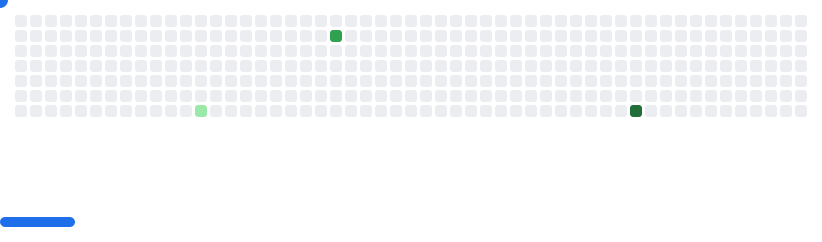

## Hey I'm Sudo 👋

```json
{
  "job": "Software Engineer",
  "birthday": "2000-08-07",
  "country": "India",
  "city": "Pune",
  "stack": ["Javascript", "Python", "Go", "Docker", "AWS", "..."],
  "interest": ["Tech", "Running", "Cycling", "Hiking", "..."]
}
```
---

<picture>
  <source media="(prefers-color-scheme: dark)" srcset="images/breakout-dark.svg">
  <source media="(prefers-color-scheme: light)" srcset="images/breakout-light.svg">
  
</picture>

## Projects

Here are some of the projects I've worked on:

1. **Project A**: A web application built with React and Node.js that allows users to manage their tasks efficiently.
2. **Project B**: A machine learning model implemented in Python to predict stock prices with high accuracy.
3. **Project C**: An open-source library for data visualization in JavaScript, making it easy to create interactive charts and graphs.

## Get in Touch

Feel free to reach out to me for collaboration, questions, or just a friendly chat!

- 📧 **Email**: sudo.chmod.git@example.com
- 💼 **LinkedIn**: [linkedin.com/in/sudo-chmod-git](https://linkedin.com/in/sudo-chmod-git)
- 🐦 **Twitter**: [twitter.com/sudo_chmod_git](https://twitter.com/sudo_chmod_git)
- 👨‍💻 **GitHub**: [github.com/sudo-chmod-git](https://github.com/sudo-chmod-git)

Thanks for stopping by! 😄


